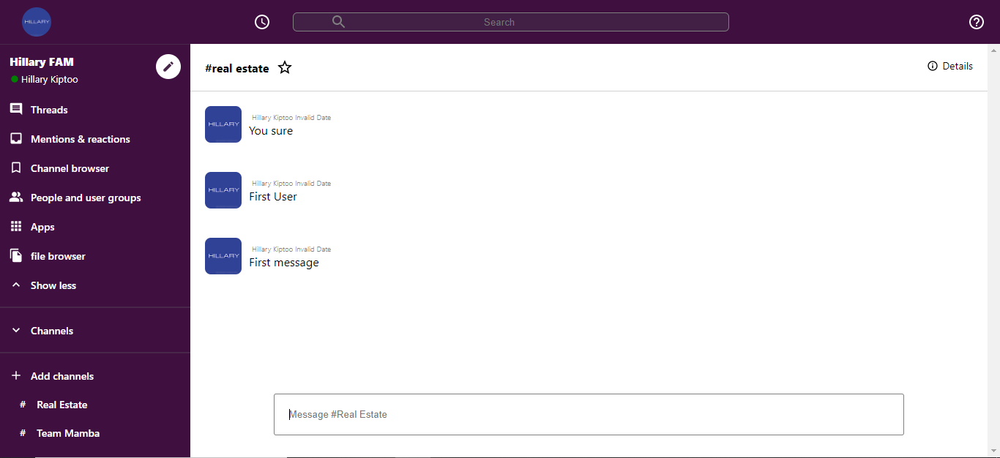

# Slack 2.0 

> Slack 2.0 !

## Description

Slack 2.0 is a slack clone built with React, Redux, Firebase hooks, Google Auth, React hooks, styled components. This slack clone allows users to
login with existing google account using firebase hooks. Users can login create channels, send messages.

## Live version

Heres a live <a href="https://slack-clone-b1sbam5fq-koktashev33-gmailcom.vercel.app/">link</a>

## Features

Slack 2.0 web app has the following features

- Create channels.
- Send messages.
- Firebase auth login.

## Built with

- HTML
- Git
- CSS
- JavaScript
- Shields.io
- Webpack
- npm
- command-line tools such as git.
- React
- Styled components
- create-react-app-buildpack
- Redux
- Firebase
- React Hooks
- Firebase Hooks

## Author

Reach out!

👤 **Konstantin Koktashev**

- LinkedIn: [Konstantin Koktashev](www.linkedin.com/in/konstantin-koktashev)
- Github: [@Konstantin-Koktashev](https://github.com/Konstantin-Koktashev)

## Contributing 🤝

Contributions, issues, and feature requests are welcome!

## Show your support

Give a ⭐️ if you like this project!
